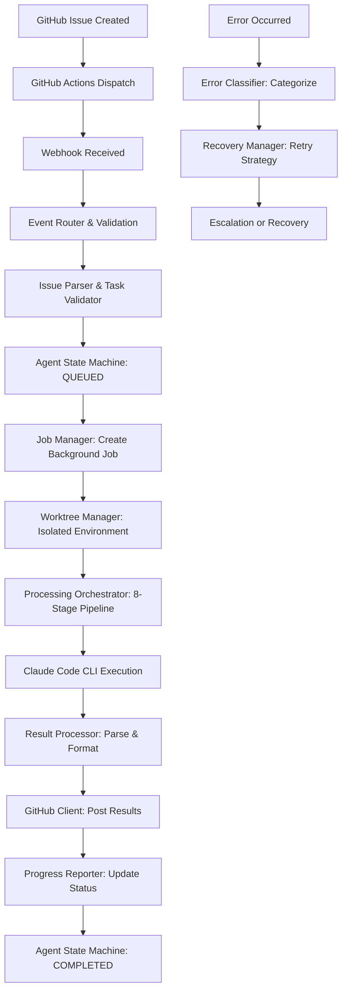

# Agentic GitHub Issue Response System

A **production-grade, AI-powered FastAPI application** with sophisticated GitHub integration that automatically processes GitHub issues using intelligent parsing, advanced state management, and rich user communication. 

## Overview

**Phase 2 Complete** - This system implements an enterprise-ready Issue-Ops workflow that:

1. **Intelligent Issue Processing**: Advanced template parsing with validation scoring and complexity estimation
2. **AI-Powered Analysis**: Claude Code CLI integration with context-aware prompt building and result processing  
3. **11-State Workflow Management**: Sophisticated state machine from queued → completed with automatic transitions
4. **Sandboxed Execution**: Isolated git worktrees with comprehensive resource management
5. **Rich User Communication**: Personalized responses, conversation memory, and real-time progress updates
6. **Robust Error Recovery**: 12-category error classification with intelligent retry strategies

## 🚀 Key Features

### Phase 2 Enhanced Capabilities
- **🧠 Intelligent GitHub Integration** - Bidirectional communication via comments, labels, and state management
- **🔄 Advanced State Machine** - 11-state agent workflow with automatic transitions and error recovery
- **💬 Rich User Experience** - Personalized responses, conversation memory, progress bars with emojis
- **🛡️ Production-Ready Reliability** - Comprehensive error handling, health monitoring, and graceful degradation
- **🔍 Smart Issue Analysis** - Template parsing, task validation, and complexity estimation
- **⚡ High Performance** - Configurable concurrency, resource cleanup, and optimized processing pipeline

### Core Infrastructure  
- **🚀 FastAPI Server** - High-performance async server with structured logging
- **🤖 Claude Code CLI** - AI-powered code analysis with intelligent prompting
- **🔒 Git Worktree Isolation** - Sandboxed processing with automatic cleanup
- **📊 Job Management** - Async processing with status tracking and cancellation
- **🔐 Security** - Webhook validation, input sanitization, sensitive data detection

## Project Structure

```
agent/
├── .github/
│   ├── ISSUE_TEMPLATE/agent-task.yml    # Structured GitHub issue forms
│   └── workflows/agent-dispatcher.yml   # GitHub Actions webhook dispatch
├── src/
│   ├── api/                             # FastAPI routes (health, webhooks, jobs)
│   ├── core/                            # Core business logic
│   ├── models/                          # Pydantic data models (github, jobs)
│   └── services/                        # 20+ specialized services
│       ├── agent_state_machine.py       # 11-state workflow engine
│       ├── github_client.py             # 25+ GitHub API methods
│       ├── processing_orchestrator.py   # Master workflow coordinator
│       ├── issue_parser.py              # Intelligent template parsing
│       ├── task_validator.py            # Multi-dimensional validation
│       ├── error_classifier.py          # 12-category error handling
│       ├── recovery_manager.py          # Automatic error recovery
│       ├── conversation_manager.py      # Context-aware conversations
│       ├── progress_reporter.py         # Rich progress communication
│       ├── health_monitor.py            # System health monitoring
│       └── [10+ other services]         # WorktreeManager, CommentAnalyzer, etc.
├── tests/                               # Comprehensive test suite
├── docs/                                # Phase 1&2 implementation summaries
├── scripts/                             # Setup and utility scripts (GitHub labels, etc.)
├── config/                              # Application configuration
├── tasks/                               # Task management and communication
└── worktrees/                           # Git worktree isolation (runtime)
```

## 🚀 Quick Start

### Prerequisites

- **Python 3.9+** with pip
- **Git** version control
- **Claude Code CLI** tool installed and authenticated
- **GitHub Personal Access Token** with repo permissions
- **GitHub CLI** (optional, for label setup)

### Installation & Setup

```bash
# 1. Clone and navigate
git clone <repository-url>
cd agent

# 2. Create virtual environment
python3 -m venv venv
source venv/bin/activate  # Linux/Mac
# venv\Scripts\activate   # Windows

# 3. Install dependencies
pip install -r requirements.txt

# 4. Environment configuration
cp .env.example .env
# Edit .env with your GitHub tokens and settings

# 5. Setup GitHub labels (optional but recommended)
./scripts/setup-github-labels.sh

# 6. Start the server
python main.py
```

**Server runs on:** `http://localhost:8080`  
**API Documentation:** `http://localhost:8080/docs`

## ⚙️ Configuration

### Environment Variables (.env)

**Essential Configuration:**
```bash
# GitHub Integration
GITHUB_WEBHOOK_SECRET=your_webhook_secret_here
GITHUB_TOKEN=ghp_your_personal_access_token_here
REPO_OWNER=your-username
REPO_NAME=your-repository

# Server Configuration
PORT=8080
HOST=0.0.0.0
DEBUG=true
LOG_LEVEL=INFO

# Claude CLI Integration
CLAUDE_CODE_PATH=claude
CLAUDE_TIMEOUT=3600

# Performance Tuning
MAX_CONCURRENT_JOBS=3
JOB_TIMEOUT=7200
WORKTREE_BASE_PATH=./worktrees
```

### GitHub Repository Setup

**1. Webhook Configuration**
- Repository Settings → Webhooks → Add webhook
- **Payload URL**: `http://your-server:8080/webhook/github`
- **Content type**: `application/json`
- **Events**: Issues, Issue comments, Pull requests
- **Secret**: Use your `GITHUB_WEBHOOK_SECRET`

**2. GitHub Actions Integration**
- Uses `.github/workflows/agent-dispatcher.yml` for auto-dispatch
- Configure `AGENT_WEBHOOK_URL` and `AGENT_WEBHOOK_SECRET` in repository secrets

**3. Issue Template Integration**
- Uses `.github/ISSUE_TEMPLATE/agent-task.yml` for structured issue creation
- Automatically adds `agent:queued` label to new agent tasks

## 🔌 API Endpoints

| Endpoint | Method | Description | Response |
|----------|--------|-------------|----------|
| `/` | GET | Welcome message and system info | JSON status |
| `/health` | GET | System health check | Health metrics |
| `/webhook/github` | POST | GitHub webhook receiver | Job creation response |
| `/jobs/{job_id}` | GET | Job status monitoring | Job details & progress |
| `/docs` | GET | Interactive API documentation | Swagger UI |
| `/redoc` | GET | Alternative API documentation | ReDoc UI |

## 🏗️ Architecture & Workflow

### Issue-Ops Workflow (Phase 2)



### 11-State Agent Workflow

**State Transitions:**
`queued` → `validating` → `analyzing` → `in-progress` → `implementing` → `testing` → `completed`

**Error States:**
`failed`, `cancelled`, `escalated`, `recovering`

### Service Architecture

**20+ Specialized Services organized in layers:**

1. **Orchestration Layer**
   - `ProcessingOrchestrator` - Master workflow coordinator
   - `EventRouter` - GitHub event dispatcher  
   - `AgentStateMachine` - 11-state workflow engine

2. **Intelligence Layer**
   - `IssueParser` - Template parsing & validation
   - `TaskValidator` - Multi-dimensional validation
   - `CommentAnalyzer` - User intent detection
   - `ErrorClassifier` - 12-category error handling

3. **Communication Layer**
   - `ConversationManager` - Context-aware conversations
   - `ResponseGenerator` - Personalized response generation
   - `ProgressReporter` - Rich progress communication
   - `GitHubClient` - 25+ specialized API methods

4. **Processing Layer**
   - `WorktreeManager` - Git isolation & cleanup
   - `ClaudeCodeService` - CLI execution wrapper
   - `ResultProcessor` - Output parsing & formatting
   - `PromptBuilder` - Context-aware prompt construction

5. **Infrastructure Layer**
   - `JobManager` - Background job lifecycle
   - `RecoveryManager` - Error recovery strategies
   - `HealthMonitor` - System health monitoring

## 🧪 Development & Testing

### Running Tests
```bash
# Run all tests
pytest tests/

# Run specific test categories
pytest tests/unit/           # Unit tests
pytest tests/integration/    # Integration tests

# Run with coverage
pytest --cov=src tests/
```

### Development Commands
```bash
# Start development server (auto-reload)
python main.py

# Start with specific configuration
DEBUG=true LOG_LEVEL=DEBUG python main.py

# Setup GitHub labels
./scripts/setup-github-labels.sh

# Verify setup
./scripts/verify-setup.sh
```

## 📈 Production Deployment

### Performance & Scalability
- **Concurrent Processing**: Configurable job limits with queue management
- **Resource Management**: Automatic cleanup and memory optimization
- **Error Recovery**: Exponential backoff with intelligent retry strategies
- **Health Monitoring**: Real-time system health with alerting thresholds

### Security Features
- **Input Validation**: Comprehensive sanitization and validation
- **Git Isolation**: Sandboxed worktree execution prevents cross-contamination
- **Webhook Security**: Cryptographic signature validation
- **Sensitive Data Detection**: Automatic detection and protection of secrets

### Monitoring & Observability
- **Structured Logging**: JSON-formatted logs with correlation IDs
- **Health Endpoints**: System health monitoring with detailed metrics
- **Job Tracking**: Complete job lifecycle with progress visibility
- **Error Classification**: Intelligent error categorization and trending

## 🤝 Usage Examples

### Creating Agent Tasks

**Via GitHub Issue Template:**
1. Navigate to your repository
2. Click "New Issue" → "🤖 New Agent Task"
3. Fill out the structured form with task details
4. Submit - automatically labeled `agent:queued`

**Example Issue Content:**
```yaml
Task Type: Code Analysis
Priority: Medium
Detailed Prompt: |
  Please analyze the performance of the user authentication system 
  and suggest optimizations. Focus on database queries and caching strategies.
Relevant Files: src/auth/, src/models/user.py
Additional Context: We're experiencing slow login times during peak hours
```

### Monitoring Progress

**GitHub Integration:**
- **Labels**: Visual state tracking (`agent:in-progress`, `agent:completed`)
- **Comments**: Real-time progress updates with emojis and progress bars
- **Notifications**: Automatic GitHub notifications for state changes

**API Monitoring:**
```bash
# Check job status
curl http://localhost:8080/jobs/{job_id}

# System health
curl http://localhost:8080/health
```

## 📚 Documentation

- **Phase 1 Summary**: `docs/phase1-implementation-summary.md`
- **Phase 2 Summary**: `docs/phase2-implementation-summary.md`
- **Testing Guide**: `docs/testing-mode-guide.md`
- **GitHub Labels**: `docs/github-labels.md`

## 🔗 Related Resources

- [Claude Code CLI Documentation](https://docs.anthropic.com/claude/docs/claude-code)
- [FastAPI Documentation](https://fastapi.tiangolo.com/)
- [GitHub Webhooks Guide](https://docs.github.com/en/developers/webhooks-and-events/webhooks)
- [GitHub Actions Documentation](https://docs.github.com/en/actions)

## 📄 License

This project is licensed under the MIT License - see the LICENSE file for details.

## 🆘 Support

- **Issues**: Create a GitHub issue for bugs or feature requests
- **Discussions**: Use GitHub Discussions for questions and community support
- **Documentation**: Check the `docs/` directory for detailed guides
